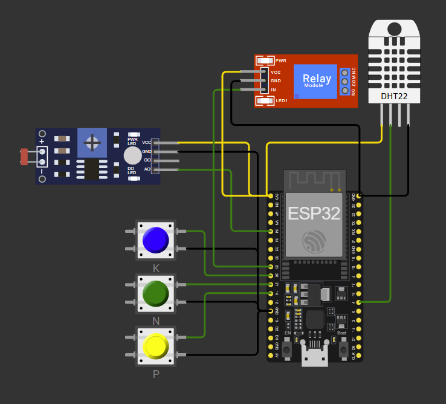
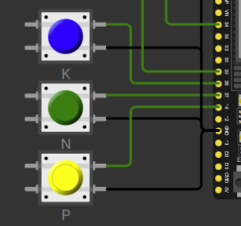
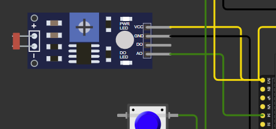
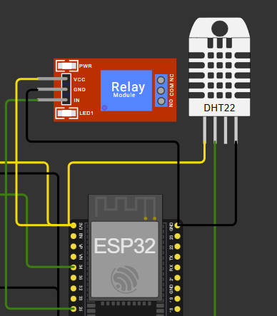

# Irrigação Inteligente para Cultura de Soja (Simulação ESP32 / Wokwi)

Projeto educacional que demonstra lógica de irrigação baseada em nutrientes (NPK), pH e umidade para a cultura da soja utilizando substituições didáticas de sensores no simulador Wokwi.

## 1. Objetivo
Automatizar a decisão de ligar/desligar a irrigação (bomba via módulo relé) considerando:
- Disponibilidade simulada dos nutrientes Fósforo (P) e Potássio (K) (críticos para produtividade).
- Nitrogênio (N) é opcional (fixação biológica da soja).
- pH do solo dentro da faixa recomendada (6.0 a 6.8).
- Umidade baixa (abaixo do limiar inferior) e histerese para desligar apenas quando suficientemente alta.

## 2. Substituições Didáticas
| Elemento real | Simulado |
|---------------|----------|
| Sensor Nitrogênio | Botão (GPIO27) |
| Sensor Fósforo | Botão (GPIO14) |
| Sensor Potássio | Botão (GPIO26) |
| Sensor pH | LDR (GPIO34 analógico) |
| Sensor Umidade Solo | DHT22 (GPIO4) |
| Bomba/valvula | Relé (GPIO25) |

## 3. Justificativa Agronômica (Simplificada)
- Faixa de pH ideal para soja: levemente ácido (~6.0–6.8) favorece a disponibilização de P.
- P e K são determinantes para formação de raízes, enchimento de grãos e resistência; exigidos simultaneamente para irrigar.
- N não é obrigatório (rizóbios fixam N atmosférico), portanto o botão N é apenas monitorado.
- Irrigação é evitada quando a umidade já está adequada (histerese para prevenir “liga/desliga” rápido).

## 4. Lógica de Decisão da Bomba
Condições para LIGAR:
```
umidade < HUM_LOW  AND  P ativo AND K ativo AND pH dentro de [SOY_PH_MIN, SOY_PH_MAX]
```
Condições para DESLIGAR (após tempo mínimo ligado):
```
umidade > HUM_HIGH OR pH fora da faixa OR (P ou K desativado) OR leitura de umidade inválida
```
Histerese:
- HUM_LOW (ex.: 50%) = limite inferior para considerar irrigar.
- HUM_HIGH (ex.: 60%) = limite superior para interromper irrigação.

Tempo mínimo ligado:
- Evita ciclos curtos (ex.: 5 segundos).

Alertas exibidos no Serial quando:
- Umidade baixa, mas nutrientes insuficientes.
- Umidade baixa, mas pH fora da faixa.
- Bomba ligada e pH saiu de faixa.

## 5. Mapeamento do pH (LDR)
ADC 0–4095 mapeado linearmente para pH 0–14:
```
pH = 14 * (ADC / 4095)
```
Filtro exponencial (PH_ALPHA) suaviza oscilações.

## 6. Pinos Utilizados
| Função | Pino ESP32 |
|--------|------------|
| N | GPIO27 |
| P | GPIO14 |
| K | GPIO26 |
| LDR (pH) | GPIO34 (ADC) |
| DHT22 | GPIO4 |
| Relé | GPIO25 |
| VCC Sensores | 3V3 |
| GND | GND |

## 7. Fluxo (Loop)
1. Ler botões N, P, K (LOW = pressionado = nutriente disponível).
2. Ler pH (ADC + filtro).
3. Ler DHT22 (a cada 2 s).
4. Atualizar lógica da bomba.
5. Registrar linha de status no Serial.

## 8. Como Testar no Wokwi
1. Construa o circuito (ver seção Imagens) ou use o diagrama do repositório.
2. Ajuste luminosidade do LDR para obter pH entre 6.0 e 6.8.
3. Pressione botões P e K (mantê-los “ON”).
4. Reduza umidade (parametrizar no popup do DHT22) abaixo de HUM_LOW → relé deve ligar.
5. Aumente umidade acima de HUM_HIGH ou solte P/K ou saia da faixa de pH → relé desliga.
6. Observe alertas no console.

## 9. Ajustes Possíveis
- Alterar faixa de pH (SOY_PH_MIN / SOY_PH_MAX) conforme literatura local.
- Ajustar limites de umidade para condições climáticas regionais.
- Registrar histórico (timestamp) para análises futuras (não incluído para simplificação).

## 10. Limitações
- Simulação não representa dinâmica real de difusão de nutrientes ou tampão de pH.
- DHT22 mede ar, não solo; leitura é apenas um proxy didático.
- pH real não responde instantaneamente à adição de nutrientes como o LDR simula.

## 11. Estrutura do Projeto
```
/src/prog1.ino      -> Lógica principal
/diagram.json        -> Desenho do circuito para Wokwi
/platformio.ini      -> Configuração PlatformIO (se usado localmente)
README.md            -> Documentação
```

## 12. Imagens
- Visão Geral


- Detalhe NPK (Botões)


-Sensor pH (LDR)


- DHT22 e Relé


## 13. Referências (Genéricas)
- Recomendação de pH para soja: faixa levemente ácida (~6.0–6.8) favorece a disponibilidade de fósforo.
- Nutrientes críticos: P e K essenciais para desenvolvimento de raízes e enchimento de grãos.
(Valores usados aqui são simplificados para fins acadêmicos.)

---
