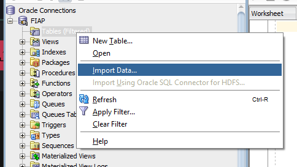
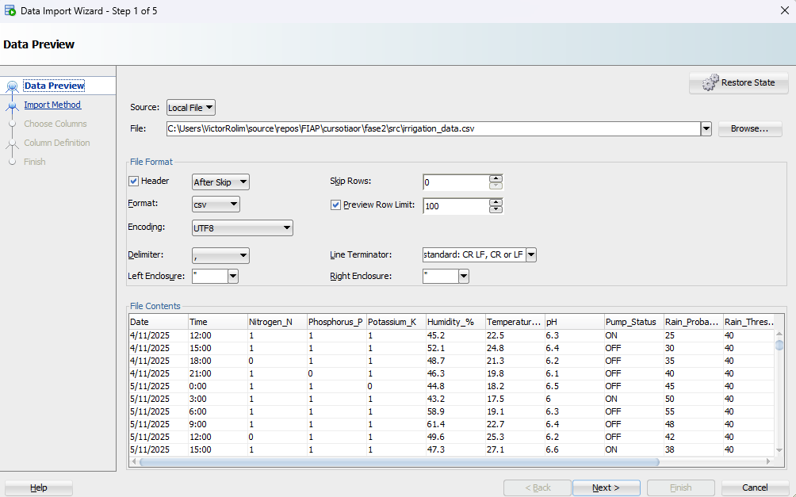
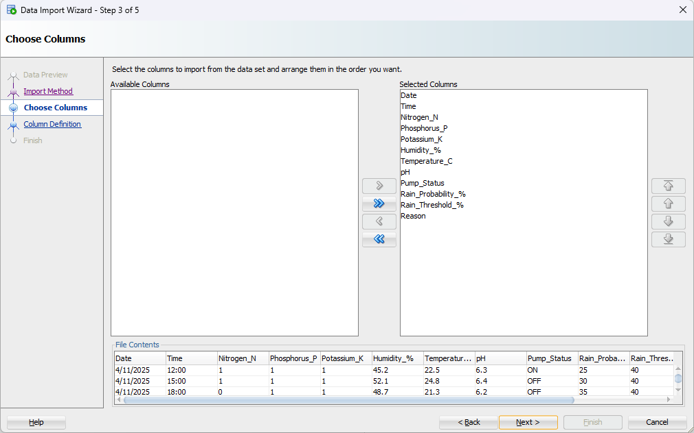
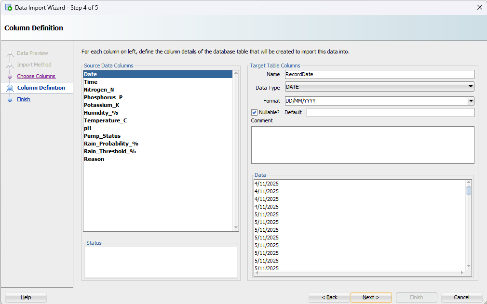
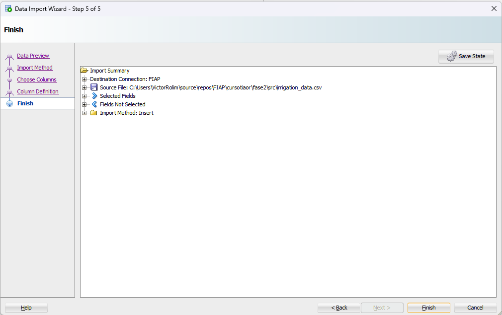
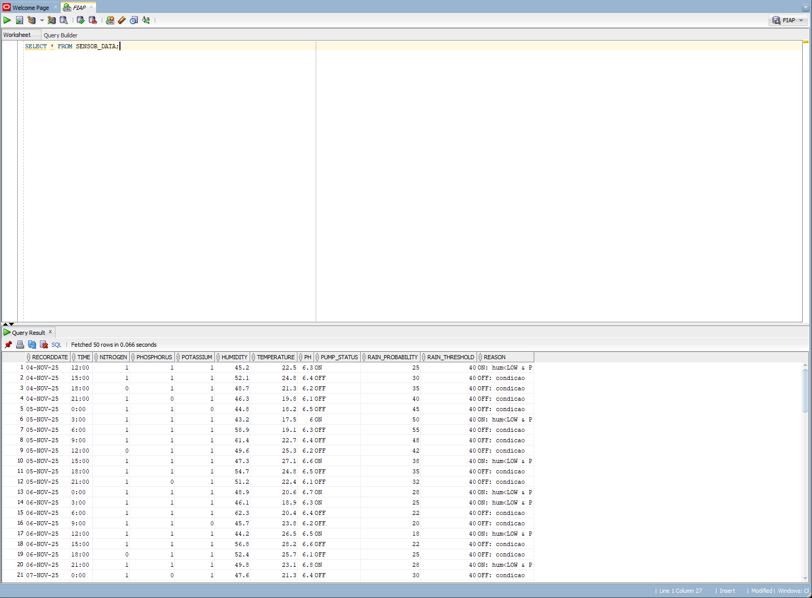

# Importação de Dados do CSV para Oracle SQL Developer

Relatório da atividade de carga dos dados da Fase 2 em um banco Oracle. Abaixo estão apenas as etapas do processo de importação dentro do Oracle SQL Developer, acompanhadas dos registros de tela solicitados.

## Arquivos Utilizados
- Planilha base: `sensor_data_fase2.csv` (arquivo fornecido na Fase 2)

## Passo a Passo de Importação
1. Clicar com o botão direito em **Tabelas (Filtrado)** e selecionar **Importar Dados** para abrir o assistente.
	

2. Carregar o arquivo `sensores_fase2.csv` no botão **Procurar** e conferir a pré-visualização dos dados.
	

3. Definir o nome da tabela (por exemplo, `SENSORES_FASE3`) e escolher o método de importação **Inserir**.
	

4. Selecionar as colunas que serão importadas (mantivemos todas as colunas do arquivo).
	

5. Ajustar os nomes das colunas se necessário.
	

6. Concluir o assistente e aguardar a confirmação de importação concluída.
	
	

7. Consultar a tabela criada executando `SELECT * FROM SENSORES_FASE3;` para validar o carregamento.
	

## Consultas Realizadas
```sql
SELECT *
FROM SENSORES_FASE3;
```

Essa consulta retornou todas as linhas do CSV importado, confirmando que os dados estão acessíveis no banco Oracle para novas análises.

# Dashboard de Monitoramento (Streamlit)

O arquivo `src/dashboard.py` implementa uma dashboard em Streamlit que consome diretamente os dados carregados no Oracle e apresenta:
- Indicadores recentes de umidade, pH, status da irrigação e presença de fósforo, potássio e nitrogênio.
- Gráficos temporais com tendências de umidade e pH, barras de presença/ausência dos nutrientes e duração de cada ciclo da irrigação.
- Sugestões automáticas de irrigação com base em clima, umidade recente, probabilidade de chuva, temperatura, pH e nutrientes.
- Tabela de dados brutos para auditoria rápida dos registros consultados.

O painel é totalmente dinâmico: toda a lógica de limpeza, normalização de colunas e geração de insights ocorre em tempo real sempre que a dashboard é acessada.

## Como executar a dashboard

1. Crie um arquivo `.env` na pasta `fase3/src` com as credenciais do Oracle:
	```env
	ORACLE_USER=seu_usuario
	ORACLE_PASSWORD=sua_senha
	ORACLE_HOST=host
	ORACLE_PORT=1521
	ORACLE_SID=sid
	ORACLE_TABLE=SENSOR_DATA
	```
2. Ative o ambiente virtual do projeto (ex.: `.venv`) e instale as dependências necessárias:
	```pwsh
	.venv\Scripts\Activate.ps1
	pip install -r requirements.txt
	```
	> Caso não exista um `requirements.txt`, instale manualmente: `pip install streamlit pandas altair python-dotenv oracledb`.
3. Execute a aplicação Streamlit na raiz do repositório:
	```pwsh
	streamlit run fase3/src/dashboard.py
	```
4. Abra o link local exibido pelo Streamlit no navegador. A dashboard carregará os últimos registros da tabela definida em `ORACLE_TABLE`.